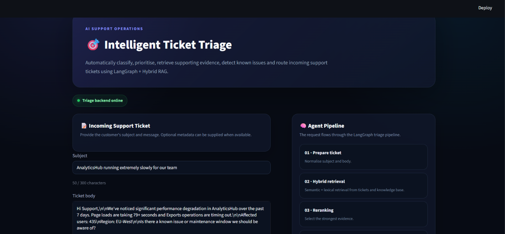
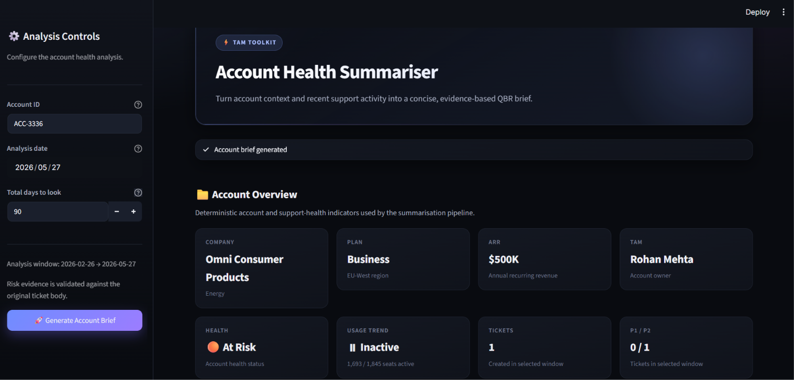
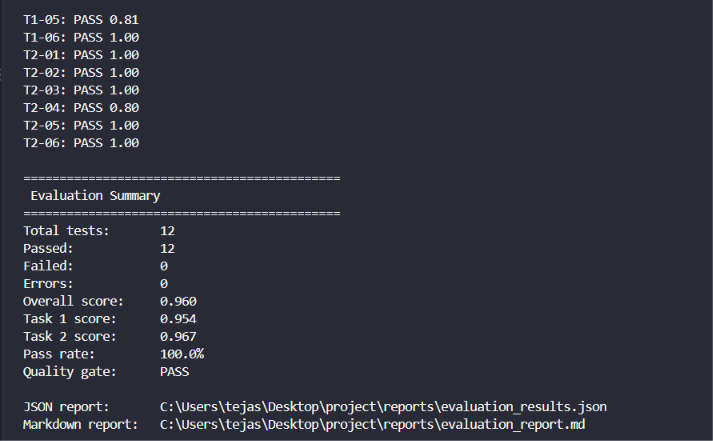

# US Delivery Internship — AI Support Engineering Task Round

This repository contains the implementation for the three AI engineering tasks:

1. **Intelligent Ticket Triage Agent**
2. **TAM Account Health Summariser**
3. **Evaluation Harness**

And the **4. design node task**

The solutions use structured LLM outputs, retrieval, orchestration, deterministic data processing, evaluation, and production-oriented application interfaces.

---

## Table of Contents

- [Project Overview](#project-overview)
  - [Task 1 — Intelligent Ticket Triage Agent](#task-1--intelligent-ticket-triage-agent)
  - [Task 2 — TAM Account Health Summariser](#task-2--tam-account-health-summariser)
  - [Task 3 — Evaluation Harness](#task-3--evaluation-harness)
- [Repository Structure](#repository-structure)
- [Setup](#setup)
- [Running Task 1](#running-task-1)
- [Running Task 2](#running-task-2)
- [Running Task 3 — Evaluation Harness](#running-task-3--evaluation-harness)
- [Evaluation Design](#evaluation-design)
- [Task 4 — Production Design Note](#task-4--production-design-note)
- [Bonus Features](#bonus-features)
- [Determinism](#determinism)
- [Security and Repository Hygiene](#security-and-repository-hygiene)
- [Sample End-to-End Workflow](#sample-end-to-end-workflow)
- [Loom Walkthrough](#loom-walkthrough)
- [Submission Checklist](#submission-checklist)

---

## Project Overview

### Task 1 — Intelligent Ticket Triage Agent

The Intelligent Ticket Triage Agent is an end-to-end support-ticket triage system built using:

- LangGraph
- LangChain
- OpenAI LLMs and embeddings
- Chroma
- Hybrid retrieval (semantic + lexical)
- Candidate reranking
- Multi-hop retrieval
- Pydantic structured output
- FastAPI
- Server-Sent Events (SSE)
- Streamlit

The system accepts an incoming support ticket containing a subject and body and produces a structured triage result.

**Pipeline:**

```text
Incoming Ticket
      │
      ▼
Ticket Understanding
      │
      ▼
Hybrid Retrieval
      │
      ├── Semantic Search
      └── Lexical Search
      │
      ▼
Candidate Reranking
      │
      ▼
Evidence Assessment
      │
      ├── Sufficient Evidence
      │
      └── Insufficient Evidence
                  │
                  ▼
             Additional Hop
                  │
                  ▼
             Maximum 3 Hops
                  │
                  ▼
          Structured Triage Result
```

The final result contains:

- product area
- issue category
- urgency tier (P1–P4)
- classification reasoning
- known-issue detection
- relevant knowledge-base evidence
- similar historical tickets
- recommended responder team
- draft first-response message

The application exposes both a normal synchronous FastAPI endpoint and a streaming endpoint. The synchronous endpoint is also used by the evaluation harness so that regression tests exercise the actual Task 1 application.

**OUTPUT:-**



### Task 2 — TAM Account Health Summariser

The TAM Account Health Summariser automatically generates an account-health brief from account information and recent support-ticket history.

The implementation uses:

- Python
- Pandas
- LangChain
- OpenAI LLM
- Pydantic structured output
- Streamlit
- Multi-stage prompt chaining

The data layer loads `accounts.json` and `tickets.json` once into memory and reuses the resulting DataFrames for subsequent account lookups.

**Pipeline:**

```text
Account ID
    │
    ▼
Account + Ticket Data
    │
    ▼
Account Analysis
    │
    ▼
Risk Detection
    │
    ▼
Final TAM Brief Synthesis
    │
    ▼
Structured Pydantic Result
    │
    ▼
Streamlit UI
```

The generated brief contains exactly the three required areas:

1. Executive Summary
2. Open Risks & Flagged Issues
3. Recommended Talking Points

Ticket-level risk findings include an evidence quote sourced from the ticket context.

The Streamlit interface allows the TAM to provide:

- Account ID
- Analysis date
- Number of days of ticket history to analyze

The analysis date defaults to the current date and cannot be moved into the future.

**OUTPUT:-**



### Task 3 — Evaluation Harness

The evaluation harness systematically evaluates both Task 1 and Task 2.

The evaluation strategy combines:

- deterministic rule-based checks
- LLM-as-judge evaluation
- weighted scoring
- quality gates
- adversarial test cases
- JSON reporting
- Markdown reporting

Task 1 is evaluated through its real FastAPI synchronous endpoint. Task 2 is evaluated through its application-level Python function, avoiding any dependency on Streamlit.

The evaluation suite contains multiple normal, edge, and adversarial cases for each task.

**Evaluation flow:**

```text
                 Evaluation Harness
                        │
             ┌──────────┴──────────┐
             │                     │
         Task 1                 Task 2
             │                     │
      FastAPI endpoint        Python function
             │                     │
             └──────────┬──────────┘
                        ▼
                 Actual Output
                        │
             ┌──────────┴──────────┐
             ▼                     ▼
        Rule Evaluation       LLM Judge
             │                     │
             └──────────┬──────────┘
                        ▼
                 Quality Score
                      0–1
                        │
                        ▼
                   PASS / FAIL
                        │
              ┌─────────┴─────────┐
              ▼                   ▼
          JSON Report        Markdown Report
```

For Task 2, factual expectations are derived directly from the Task 2 data layer rather than manually duplicating account and ticket facts in the evaluation suite.

---

**OUTPUT:-**



## Repository Structure

```text
project/
│
├── task_1_intelligent_ticket_triage_agent/
│   ├── ...
│   └── ...
│
├── task_2_tam_account_health_summariser/
│   ├── __init__.py
│   ├── app.py
│   ├── get_data.py
│   ├── schemas.py
│   ├── summary.py
│   │
│   └── prompts/
│       ├── __init__.py
│       ├── ...
│
├── task_3_evaluation_harness/
│   ├── __init__.py
│   ├── cases.py
│   ├── evaluator.py
│   ├── judge.py
│   ├── report.py
│   ├── rules.py
│   ├── schemas.py
│   ├── task1_runner.py
│   ├── task2_expectations.py
│   ├── task2_runner.py
│   └── run_evals.py
│
├── data/
│   ├── accounts.json
│   └── tickets.json
│
├── reports/
│   ├── eval_report.json
│   └── eval_report.md
│
├── .env.example
├── .gitignore
├── pyproject.toml
├── uv.lock
└── README.md
```

---

## Setup

This project uses [**uv**](https://docs.astral.sh/uv/) for environment and dependency management instead of `venv`/`pip`.

### 1. Clone the repository

```bash
git clone https://github.com/Tejas-Pokale/multi-agent-ai-system.git
cd <YOUR_REPOSITORY_DIRECTORY>
```

### 2. Install uv (if not already installed)

macOS/Linux:

```bash
curl -LsSf https://astral.sh/uv/install.sh | sh
```

Windows (PowerShell):

```powershell
powershell -ExecutionPolicy ByPass -c "irm https://astral.sh/uv/install.ps1 | iex"
```

### 3. Create the virtual environment and install dependencies

The project uses `pyproject.toml`:

```bash
uv sync
```

This creates a `.venv` automatically and installs all dependencies from `pyproject.toml` / `uv.lock`.

Also run the `requirements.txt`:

```bash
uv venv
uv pip install -r requirements.txt
```

### 4. Activate the environment

macOS/Linux:

```bash
source .venv/bin/activate
```

Windows:

```powershell
.venv\Scripts\activate
```

> Activation is optional — any command can also be run directly with `uv run <command>` without activating the environment (used throughout this README).

### 5. Configure environment variables

Create a `.env` file from `.env.example`:

```bash
cp .env.example .env
```

On Windows PowerShell:

```powershell
Copy-Item .env.example .env
```

The required variables are:

```env
OPENAI_API_KEY=
OPENAI_LLM_MODEL=
OPENAI_EMBEDDING_MODEL=
```

The real `.env` file must never be committed to Git.

---

## `.env.example`

The repository includes a safe example configuration:

```env
OPENAI_API_KEY=your_openai_api_key_here
OPENAI_LLM_MODEL=your_llm_model_here
OPENAI_EMBEDDING_MODEL=your_embedding_model_here
```

For evaluation, the Task 1 endpoint can additionally be configured using:

```env
TASK1_BASE_URL=http://127.0.0.1:8000
TASK1_ENDPOINT=/triage
TASK1_TIMEOUT_SECONDS=180
```

Update the Task 1 endpoint if your FastAPI route differs.

---

## Running Task 1

Task 1 exposes a FastAPI service.

Start the FastAPI application using the Task 1 application entry point:

```bash
pythom -m uv run uvicorn task_1_triage_agent.backend.api:app --host 127.0.0.1 --port 8000
```

The normal synchronous triage endpoint is:

```text
POST /triage
```

A sample request:

```json
{
  "subject": "Production pipeline failing",
  "body": "Our production pipeline has been failing since this morning and is affecting multiple users. Please help urgently."
}
```

Also you can directly run streamlit app which starts the backend automatically:

```bash
py -m streamlit run task_1_triage_agent\app.py
```

A successful response contains the structured triage result including classification, prioritisation, reasoning, evidence, routing, and draft response.

Task 1 also provides a streaming endpoint for live execution progress.

---

## Running Task 2

Start the Streamlit application:

```bash
uv run streamlit run task_2_tam_account_health_summariser/app.py
```

Then open the local Streamlit URL shown in the terminal.

The UI provides:

```text
Account ID
Analysis Date
Total Days to Look
```

Example:

```text
Account ID:       ACC-3336
Analysis Date:    2026-08-27
Total Days:       90
```

The resulting account brief contains:

```text
1. Executive Summary

2. Open Risks & Flagged Issues

3. Recommended Talking Points
```

During processing, the application displays live pipeline progress rather than leaving the UI apparently frozen during multiple LLM calls.

---

## Running Task 3 — Evaluation Harness

Task 3 evaluates both applications.

### Start Task 1 first

Because Task 1 is evaluated through its actual FastAPI endpoint, the Task 1 server must be running.

For example:

```bash
uv run uvicorn <task1_module>:app --host 127.0.0.1 --port 8000
```

### Run the evaluation harness

From the repository root:

```bash
python -m task_3_evaluation_harness.run_evals
```

Task 2 does not require the Streamlit application to be running. The evaluator imports the Task 2 summarisation function directly.

The evaluator produces:

```text
reports/
├── eval_report.json
└── eval_report.md
```

The report contains:

- test-case status
- quality score from 0 to 1
- rule-based score
- LLM-judge score
- latency where applicable
- adversarial test markers
- criterion-level reasoning
- aggregate task scores
- overall quality gate

A typical result looks like:

```text
T1-01: PASS 0.94
T1-02: PASS 0.91
T1-03: PASS 0.90
...

T2-01: PASS 0.91
T2-02: PASS 0.87
T2-03: PASS 0.89
...

Overall score: 0.89
Quality gate: PASS
```

The actual values depend on the model and current application outputs.

---

## Evaluation Design

The evaluation harness uses a hybrid approach.

**Deterministic checks** are preferred whenever a property can be directly established from the source data, including:

- account identity
- account health status
- usage trend
- deterministic metrics
- ticket IDs
- ticket analysis windows
- existence of required sections
- direct evidence quotes

**LLM-as-judge evaluation** is used for semantic properties that are difficult to express as exact assertions, such as:

- reasoning quality
- synthesis quality
- ambiguity handling
- usefulness of TAM talking points
- quality of the draft response
- grounded interpretation of risk

Each criterion receives a score between `0` and `1`, and weighted criteria are combined into a test-case quality score.

Adversarial cases cover scenarios including:

- ambiguous tickets
- incomplete ticket information
- narrow historical windows
- account/ticket source inconsistencies
- incomplete or imperfect customer context

Each evaluation report records the active prompt versions used for the run. This provides prompt-level regression traceability alongside the Git commit that contains the full historical prompt text.

---

## Task 4 — Production Design Note

### Failure Modes

**1. Incorrect or hallucinated AI output.** In Task 1, the model could classify a ticket into the wrong product area, category, or urgency, retrieve an irrelevant knowledge-base document, or recommend an inappropriate responder team. In Task 2, the model could overstate account-health concerns, misunderstand the relationship between account-level signals and individual tickets, or identify a churn/escalation risk without sufficient evidence.

- *Detection:* the evaluation harness, which tests both systems against known acceptance criteria and adversarial cases. Structured Pydantic outputs also provide a predictable contract for downstream components.
- *Mitigation:* improving prompts using observed failures, strengthening retrieval and reranking in Task 1, keeping deterministic calculations outside the LLM in Task 2, and using a quality gate so low-scoring model versions are not silently promoted.

**2. Incorrect or inconsistent source data.** This is particularly relevant because account-level and ticket-level fields can disagree.

- *Approach:* use `account_id` as the authoritative join key, use the account record as the source of truth for account-level attributes, and use the individual ticket record as the source of truth for ticket-specific properties such as urgency, status, and ticket text. For Task 2, the selected analysis date and time window are also applied deterministically before data is sent to the LLM.
- *Detection:* schema validation, deterministic data checks, and regression cases designed around inconsistent or incomplete records.
- *Mitigation:* important conflicts should be surfaced rather than silently "fixed" by the model.

**3. LLM/API failure, including timeout, rate limiting, or degraded latency.** Task 1 and Task 2 both depend on external model inference, while Task 2 performs multiple sequential LLM calls.

- *Requirements:* request timeouts, bounded retries, structured exception handling, and monitoring of API error rates and latency. The UI should fail gracefully rather than appearing frozen or returning a misleading partial answer.
- *Mitigation:* model fallbacks, caching deterministic intermediate data, asynchronous execution, and circuit-breaking during prolonged provider failures. Evaluation scores and latency should be tracked after every model or prompt change so operational degradation is visible alongside quality degradation.

### Latency vs Quality

For Task 2, I made a deliberate trade-off in favor of **output quality and reasoning separation**. Rather than asking one prompt to understand account health, detect risks, and write the final QBR brief simultaneously, the system uses a three-stage LangChain pipeline: account analysis, risk detection, and final synthesis. This requires multiple LLM calls and therefore increases end-to-end latency, but it gives each stage a focused objective and makes the resulting structured output easier to reason about and evaluate. Deterministic metrics such as seat utilization and ticket counts are calculated in Python instead of asking the model to perform arithmetic.

If latency became the hard constraint, I would:

- Collapse the three stages into a **single LLM call**
- Keep all deterministic calculations in Python
- Use a smaller, faster model
- Reduce the amount of ticket history sent to the model, prioritizing the most recent or highest-value tickets rather than the full available history

The trade-off would be lower reasoning separation and potentially weaker risk detection, but substantially lower token usage, API calls, and response time.

### Data Sensitivity

Account and support-ticket data can contain PII and commercially sensitive information, so production systems should follow a **data-minimization approach**. The current implementation sends application context to an external OpenAI model, so a production implementation should first identify information that is unnecessary for the particular reasoning task. Names, email addresses, phone numbers, free-form personal details, and other sensitive fields should be removed, masked, or tokenized when they are not required for the output.

Additional safeguards:

- Avoid writing raw ticket bodies or complete prompts to application logs
- Authenticate and authorize access to the service
- Use encryption in transit for network communication
- Protect stored evaluation/reporting artifacts appropriately
- Configure external model-provider retention and privacy settings according to organizational requirements

For environments where customer data cannot leave the organization's controlled boundary, the same application interfaces could be retained while replacing the external LLM with a privately hosted model.

**Key principle:** the application should send the minimum data required to perform the task, rather than automatically exposing the full account record and ticket history.

### Scaling

At **10× the current ticket volume**, the first limitation in Task 2 would likely be **LLM input size, token cost, and latency — rather than pandas filtering**. The current data layer loads the JSON datasets once into memory, which is efficient at the mock-data scale, and ticket filtering itself is straightforward. However, sending increasingly large ticket histories through multiple LLM stages causes the context to grow, increasing token consumption, API cost, latency, and the possibility of exceeding model context limits.

**First architectural change:** reduce the amount of raw ticket data reaching the model by introducing deterministic pre-filtering, aggregation, chunking, or retrieval so that only the most relevant tickets are included in the reasoning context.

Task 1 would face a similar scaling issue in its retrieval layer. Larger ticket and knowledge-base collections increase semantic retrieval, lexical retrieval, reranking, and multi-hop costs. At that point:

- Local application storage would be replaced or backed by a scalable vector/search service
- Caching could be introduced for repeated retrieval patterns
- Both tasks would benefit from asynchronous processing, concurrency limits, and monitoring of token usage
- Separate metrics should track retrieval latency, model latency, and total request latency

**Key scaling principle:** keep deterministic processing outside the LLM and minimize the amount of information sent to the model. Ten times more raw data should not result in ten times more prompt tokens or ten times more LLM reasoning.

---

## Bonus Features

### Thin TAM-facing Streamlit UI — +5

Task 2 includes a dedicated Streamlit interface designed for non-technical TAM users.

The UI hides the underlying implementation details and exposes only the information required to perform an account-health analysis:

```text
Account ID
Analysis Date
Days of Ticket History
```

The generated result is presented as:

- account overview
- executive summary
- open risks and evidence
- actionable TAM talking points

No knowledge of LangChain, Pydantic, Python, or LLM prompting is required to use the interface.

### Streaming Output — +3

Task 2 exposes:

```python
summarize_account_stream(...)
```

which emits progress events while the multi-stage summarisation pipeline executes.

The Streamlit application consumes those events to display live progress between LLM stages, preventing the interface from appearing frozen during longer model calls.

Task 1 also exposes a streaming API through its FastAPI SSE endpoint.

### Automated Evaluation in CI — +2

GitHub Actions can run the evaluation harness automatically on pushes and pull requests.

The intended CI flow is:

```text
GitHub Push / Pull Request
          │
          ▼
Install Dependencies (uv sync)
          │
          ▼
Start Task 1 FastAPI Server
          │
          ▼
Run Evaluation Harness
          │
          ▼
Task 1 + Task 2 Evaluation
          │
          ▼
Quality Gate
          │
      ┌───┴───┐
      ▼       ▼
    PASS     FAIL
```

The evaluation job uses GitHub Secrets for sensitive environment variables and never stores real API keys in the repository.

### Prompt Versioning — +2

Task 2 uses independent prompt files under the `prompts/` directory. Each prompt file contains the currently active prompt, its semantic version, and a changelog describing changes made to that prompt.

Example:

```text
task_2_tam_account_health_summariser/
└── prompts/
    ├── __init__.py
    ├── prompt_account_analysis_system.py
    ├── prompt_account_analysis_human.py
    ├── prompt_risk_detection_system.py
    ├── prompt_risk_detection_human.py
    ├── prompt_final_brief_system.py
    └── prompt_final_brief_human.py
```

A prompt file follows this pattern:

```python
PROMPT_VERSION = "1.1.0"

SYSTEM_PROMPT = """
...
"""

CHANGELOG = [
    {
        "version": "1.1.0",
        "date": "2026-08-28",
        "changes": [
            "Clarified the distinction between account-level P1 statistics "
            "and individual ticket urgency.",
            "Added instructions for historical analysis dates."
        ],
    },
    {
        "version": "1.0.0",
        "date": "2026-08-27",
        "changes": [
            "Initial prompt version."
        ],
    },
]
```

Only the latest active prompt is stored in the prompt file. When a prompt is changed, its `PROMPT_VERSION` is incremented and a new entry is added to the changelog.

Historical prompt text is preserved by Git rather than by creating separate files such as `prompt_v1.py`, `prompt_v2.py`, etc. Git therefore provides the complete version history, including the previous prompt content, commit, author, timestamp, diff, and the ability to revert to an earlier version. For example:

```text
Git commit A
    risk_detection.py
    PROMPT_VERSION = "1.0.0"
            ↓
Prompt updated
            ↓
Git commit B
    risk_detection.py
    PROMPT_VERSION = "1.1.0"
```

The evaluation harness records the prompt versions used during an evaluation run. This makes it possible to identify whether a regression was introduced by a prompt change.

Example evaluation metadata:

```json
{
  "prompt_versions": {
    "account_analysis": "1.0.0",
    "risk_detection": "1.1.0",
    "final_brief": "1.0.0"
  }
}
```

We use semantic versioning:

- `PATCH` — wording, typo, or formatting-only change
- `MINOR` — meaningful prompt improvement without changing the overall contract
- `MAJOR` — fundamental change to prompt behavior or output expectations

---

## Determinism

Both tasks use deterministic design choices wherever practical.

Task 2 uses:

```text
temperature = 0
```

and deterministic Python-side operations for:

- data filtering
- sorting
- metrics
- date-window calculations
- report ordering

The evaluation harness also runs test cases in deterministic case-ID order and records prompt/model context in the generated reports.

LLM systems can still have provider/model-level nondeterminism even at zero temperature, so evaluation results should be interpreted as regression signals rather than mathematical guarantees of identical generation.

---

## Security and Repository Hygiene

The repository must never contain:

```text
.env
API keys
private credentials
secrets
```

Only the following should be committed:

```text
.env.example
```

Example:

```env
OPENAI_API_KEY=your_openai_api_key_here
OPENAI_LLM_MODEL=your_llm_model_here
OPENAI_EMBEDDING_MODEL=your_embedding_model_here
```

The real `.env` file should be included in `.gitignore`.

---

## Sample End-to-End Workflow

### Task 1

Start the FastAPI service:

```bash
uv run uvicorn task_1_triage_agent.backend.api:app --host 127.0.0.1 --port 8000
```

Submit a ticket through the normal `/triage` endpoint or use the Task 1 Streamlit interface.

### Task 2

Start Streamlit:

```bash
py -m streamlit run task_2_tam_account_health_summariser/app.py
```

Select an account, analysis date, and ticket-history window and generate the TAM brief.

### Task 3

Keep the Task 1 API running and execute:

```bash
python -m task_3_evaluation_harness.run_evals
```

Review:

```text
reports/eval_report.json
reports/eval_report.md
```

---

## Loom Walkthrough

Loom video:

https://www.loom.com/share/5022943dea5b457fad45665685af2b3b

The video will demonstrate:

1. Task 1 code architecture and live ticket triage
2. Task 2 account-health summarisation
3. Task 2 streaming progress
4. Task 3 evaluation harness execution
5. Evaluation report and quality scores

---

## Submission Checklist

- [done] Public/shared GitHub repository
- [done] Top-level README
- [done] Setup instructions
- [done] Task 1 sample run
- [done] Task 2 sample run
- [done] Task 3 evaluation instructions
- [done] Task 4 design note
- [done] Evaluation report included in repository
- [done] `.env.example` included
- [done] Real `.env` excluded from repository
- [done] Loom URL inserted
- [done] Streamlit TAM UI
- [done] Streaming output
- [done] Automated evaluation harness
- [done] Prompt versioning

---